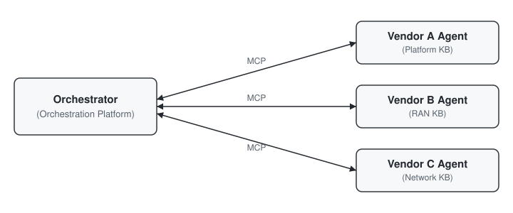

# mcp-multivendor-tutorial

A hands-on tutorial for building multivendor agentic AI integrations using the
Model Context Protocol (MCP). Demonstrates how a network orchestration
platform can discover and invoke vendor-hosted knowledge agents to retrieve
product knowledge, search support case history, and assist with root cause
analysis across a multivendor infrastructure stack.

## Why MCP for Multivendor

In a multivendor telco or enterprise environment, each infrastructure vendor
(platform, RAN, networking, storage) has proprietary product knowledge that an
operator's orchestration layer needs to query during troubleshooting, RCA, or
automation. MCP provides a standard protocol for this:

- **Tool discovery** -- the orchestrator discovers what each vendor can answer
- **Structured invocation** -- queries and responses follow a defined schema
- **Security boundary** -- vendor knowledge stays on vendor infrastructure;
  only diagnostic queries and answers cross the boundary
- **Vendor independence** -- the orchestrator uses the same protocol for every
  vendor, regardless of their internal stack



## Repository Structure

```
mcp-multivendor-tutorial/
├── README.md                          # this file
├── .env.example                       # environment config template
├── .gitignore
├── requirements.txt                   # Python dependencies
├── package.json                       # Node.js dependencies
├── tsconfig.json
├── examples/
│   ├── 01_basic_mcp_server/           # build a vendor knowledge agent
│   │   ├── server.py                  # Python MCP server
│   │   └── server.ts                  # TypeScript MCP server
│   ├── 02_basic_mcp_client/           # connect an orchestrator to the agent
│   │   ├── client.py                  # Python MCP client
│   │   └── client.ts                  # TypeScript MCP client
│   └── 03_red_hat_mcp_client/         # connect to a live Red Hat MCP server
│       ├── client.py                  # Python client with OAuth2 + mTLS
│       └── client.ts                  # TypeScript client with OAuth2 + mTLS
├── security/
│   ├── README.md                      # mTLS + OAuth2 walkthrough
│   └── generate_certs.sh              # generate test PKI cert chain
└── certs/                             # generated certs (gitignored)
```

## Quick Start

### Prerequisites

- Python 3.11+ or Node.js 20+
- OpenSSL (for certificate generation)
- Red Hat SSO credentials (for example 03 only)

### Setup

```bash
# clone the repo
git clone https://github.com/dkypuros/mcp-multivendor-tutorial.git
cd mcp-multivendor-tutorial

# copy environment config
cp .env.example .env

# install dependencies (pick one or both)
pip install -r requirements.txt
npm install
```

### Example 01: Build a Vendor Knowledge Agent

A minimal MCP server exposing two tools: `query_knowledge_base` and
`search_case_history`. This is what a vendor builds and hosts.

```bash
# Python
python examples/01_basic_mcp_server/server.py

# TypeScript
npx tsx examples/01_basic_mcp_server/server.ts
```

The server runs on STDIO transport. It exposes:

| Tool | Description |
|------|-------------|
| `query_knowledge_base` | Search product documentation by keyword |
| `search_case_history` | Find similar past support cases and resolutions |

### Example 02: Connect an Orchestrator

An MCP client that connects to the server from example 01, discovers its
tools, and invokes them. This is what the orchestrator (orchestration
platform, agent fabric, copilot) does.

```bash
# Python (from examples/02_basic_mcp_client/)
cd examples/02_basic_mcp_client
python client.py

# TypeScript (from examples/02_basic_mcp_client/)
cd examples/02_basic_mcp_client
npx tsx client.ts
```

Expected output:

```
Available tools:
  - query_knowledge_base: Search the vendor product knowledge base...
  - search_case_history: Search past support case resolutions...

--- Query: 'openshift' ---
- openshift: OpenShift is a Kubernetes-based container platform...

--- Case search: 'upgrade' ---
- [CASE-001] OCP node not ready after upgrade
  Resolution: Drain node, clear kubelet certs, restart kubelet.

--- Query: 'satellite' ---
No knowledge base entries found for 'satellite'.
```

### Example 03: Connect to a Red Hat MCP Server

Connects to a live Red Hat MCP server from the
[Red Hat Ecosystem Catalog](https://catalog.redhat.com) using OAuth2 client
credentials and optional mTLS.

Available Red Hat MCP servers:

| MCP Server | Scope |
|------------|-------|
| MCP Server for RHEL | Red Hat Enterprise Linux knowledge |
| MCP Server for Red Hat OpenShift | OpenShift knowledge |
| Red Hat Lightspeed MCP Server | Lightspeed capabilities |
| MCP Server for Red Hat Security Content | CVEs, security advisories |
| MCP Server for Red Hat Product Information | Cross-product info and lifecycle |

```bash
# configure credentials in .env first
vim .env

# Python
python examples/03_red_hat_mcp_client/client.py

# TypeScript
npx tsx examples/03_red_hat_mcp_client/client.ts
```

## Security Setup

Full walkthrough in [`security/README.md`](security/README.md).

### Generate test certificates (mTLS)

```bash
cd security
chmod +x generate_certs.sh
./generate_certs.sh
```

This creates a three-tier PKI chain:

```
Root CA
  └── Intermediate CA
        ├── Server cert  (for the MCP server)
        └── Client cert  (per-partner, for the orchestrator)
```

### Security layers

| Layer | Mechanism | Purpose |
|-------|-----------|---------|
| Transport | mTLS (PKI cert chain) | Mutual identity verification |
| Application | OAuth2 client credentials | Session authorization |
| Network | IP allowlist / VPN | Source network restriction |
| Data | Query-only boundary | Vendor knowledge never leaves vendor infra |

### Centralized gateway auth and rate limiting

For deployments with many vendor MCP servers, see
[`docs/kuadrant_authorino_mcp_gateway.md`](docs/kuadrant_authorino_mcp_gateway.md) for a
Gateway API + Kuadrant pattern (the open-source basis for Red Hat OpenShift Connectivity Link)
that centralizes authentication and rate limiting in front of the whole fleet.

## Concepts

### MCP Transports

| Transport | When to use |
|-----------|-------------|
| **STDIO** | Local development, subprocess spawning |
| **Streamable HTTP** | Production, cross-network, supports mTLS |

### Integration Patterns

| Pattern | Protocol | Connectivity | Knowledge Freshness |
|---------|----------|-------------|-------------------|
| Vendor Agent (outside network) | MCP/A2A | Live, real-time | Always current |
| Vendor Agent (inside network) | MCP (local) | Air-gapped | Tied to S/W release |
| Vendor Portal (REST) | HTTP/REST | Live, real-time | Always current |
| Offline Docs (Pre-RAG) | File download | Fully offline | Tied to doc release |

### Per-Partner Onboarding

Adding a new partner (orchestrator) to an existing MCP server:

1. Generate a client certificate with a unique OU (partner name)
2. Sign it with the intermediate CA
3. Register an OAuth2 client in the vendor SSO
4. Deliver cert + credentials to the partner
5. No server-side code changes -- same image serves all partners

## API Reference

### Red Hat Developer API Catalog

49 REST APIs available at
[developers.redhat.com/api-catalog](https://developers.redhat.com/api-catalog),
organized by platform (OpenShift, RHEL, Ansible) and use case (Observe,
Security, Automation, Infrastructure).

### Red Hat MCP Servers (Ecosystem Catalog)

Containerized MCP servers available at
[catalog.redhat.com](https://catalog.redhat.com) (search "MCP server").

## Contributing

1. Fork the repository
2. Create a feature branch
3. Submit a pull request

## License

Apache License 2.0
