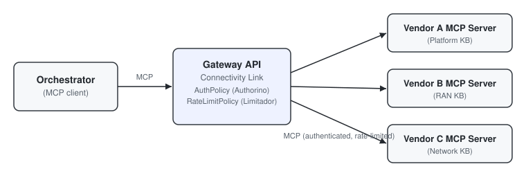
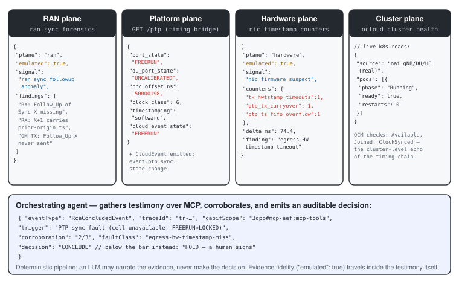
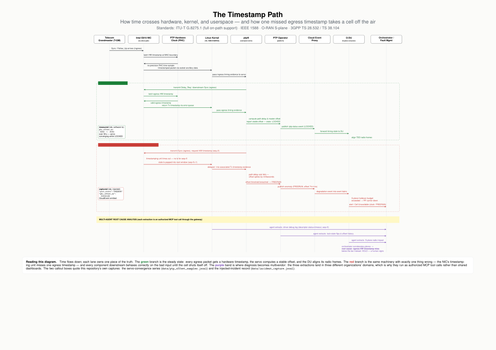

# Diagrams

SVG architecture diagrams used across the tutorial. Each is listed with what it shows and where
it appears.

## `architecture.svg` — the basic multivendor pattern

The tutorial's starting point: an orchestration platform speaking MCP directly to each vendor's
knowledge agent. Every connection is secured individually (mTLS + OAuth2, per
[`security/README.md`](../../security/README.md)). There is deliberately **no gateway in this
picture** — it shows the pattern before centralized enforcement is introduced.

Used in: the [root README](../../README.md) ("Why MCP for Multivendor").

## `auth_gateway.svg` — the MCP Gateway

The evolution of the first diagram: the same orchestrator and vendor MCP servers, now with an
**MCP Gateway** (Gateway API + Kuadrant / Connectivity Link) between them. The gateway enforces
authentication (`AuthPolicy` via Authorino) and rate limiting (`RateLimitPolicy` via Limitador)
in one place, so the vendor servers stay focused on their domain knowledge.

Used in: the root README ("Centralized gateway auth and rate limiting") and
[`docs/kuadrant_authorino_mcp_gateway.md`](../kuadrant_authorino_mcp_gateway.md).

## `evidence_chain.svg` — the multivendor RCA evidence chain

Four vendor-owned evidence planes — RAN alerts, platform timing, protocol forensics, hardware
counters — each exposed as MCP testimony, corroborated by an orchestrating agent that only
concludes when independent planes agree.

Used in: [`docs/multivendor_rca_pattern.md`](../multivendor_rca_pattern.md).

## `timestamp_path.svg` / `timestamp_path.pdf` — the timestamp path

Nine lanes from Grandmaster to orchestrator; the green branch is the steady state, the red
branch is the egress-timestamp miss, the purple band is the multi-agent RCA. Built with LaTeX
TikZ (source in [`src/`](src/)); the PDF is the print/download version.

Used in: [`docs/timestamp_path.md`](../timestamp_path.md).

## Conventions

- Diagrams are standalone `.svg` files referenced with `` tags — GitHub strips inline
  `<svg>` markup from rendered markdown, so inline SVG is never used.
- Read the two diagrams in order: `architecture.svg` is the "before," `auth_gateway.svg` the
  "after." The narrative connecting them (and the enforcement layers beyond the gateway) is in
  [`docs/README.md`](../README.md).
